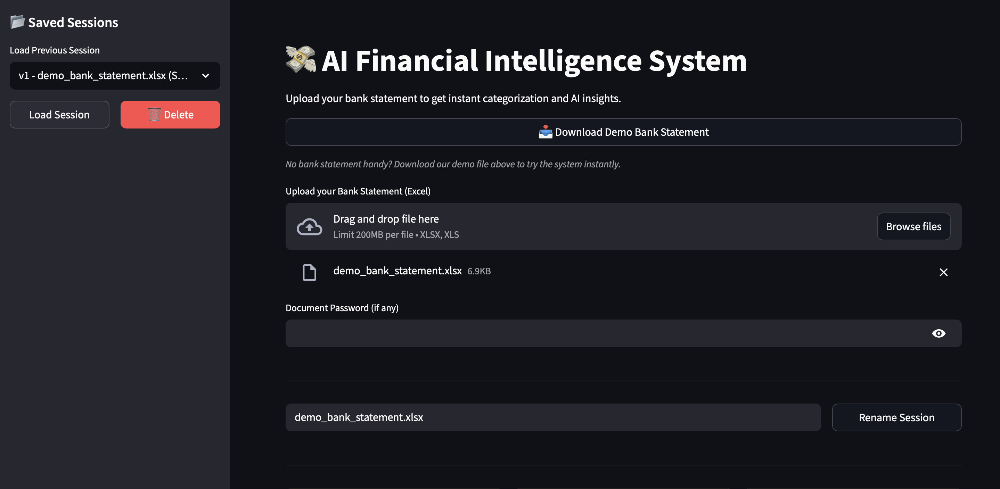
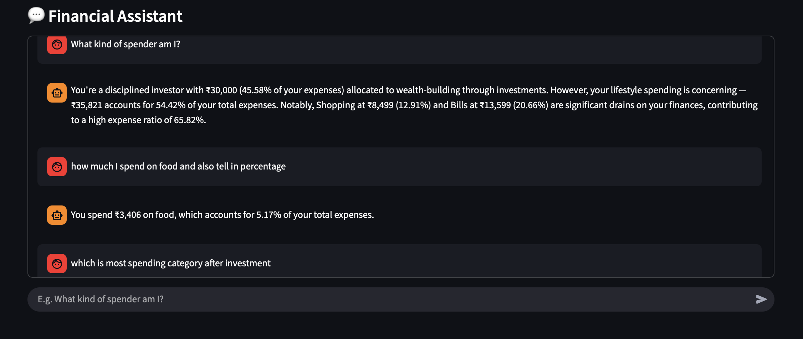
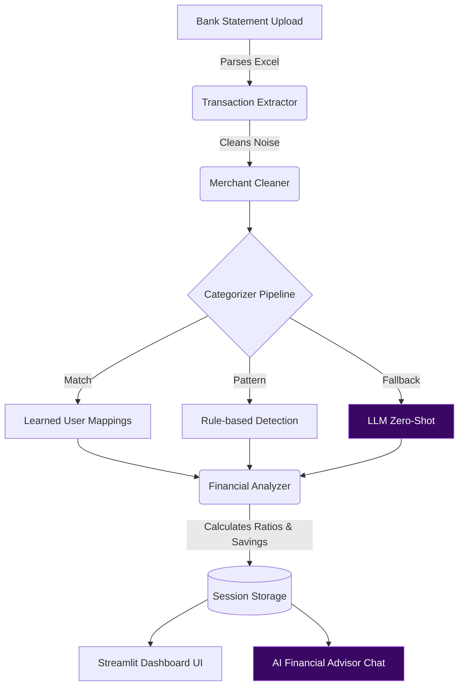

# 💸 AI Financial Intelligence System

> Upload your bank statement → get categorized spending, financial health score, and AI advice in seconds.

🚀 **Live Demo:** [ai-financial-engine.streamlit.app](https://ai-financial-engine.streamlit.app)  
📄 **Try Sample File:** [Download Demo Statement](./frontend/demo_statement.xlsx)


## ⚡ How it works

1. **Upload bank statement** (Excel)
2. **AI cleans + categorizes** transactions
3. **Get dashboard + financial insights + chat assistant**

---

## 📊 Dashboard Preview

Shows income, expenses, savings, and expense ratio with instant alerts.



## 💬 AI Financial Assistant

Receive mathematically grounded advice based on your exact saving & spending ratios.



---

## 🌍 Why this matters

### The Reality Today
- Bank statements are unreadable (UPI noise, codes, references)
- No distinction between investments vs expenses
- No actionable insights

### What we built
An AI system that understands financial context — not just transactions. It turns raw financial data into **decision intelligence**.

---

## 🧠 Self-Learning System

**Edit any transaction category → the system remembers your preference and improves over time.**

No retraining. No config. Just usage. If you categorize a specific vendor as an Investment once, the system respects and overrides default behaviors for all future uploads.

---

## ✨ Key Innovations

1. **Investment-Aware AI Engine**: Traditional apps view a `₹50,000` outflow as a "high expense." Our engine distinguishes between a wealth-building SIP (categorized as *Investments*) and a luxury purchase, calculating an intelligent **Expense Ratio** to assess true financial health.
2. **Tri-Layer Categorization**:
    *   **Layer 1 (Learned):** User-defined customizations overrule everything.
    *   **Layer 2 (Deterministic):** Fast, rule-based keyword & pattern matching (e.g., detecting "Groww", "Zerodha" or "SIP").
    *   **Layer 3 (LLM Fallback):** For unknown string blobs, the AI infers the category via zero-shot classification.
3. **Smart Merchant Cleaning**: We don't feed raw UPI noise to the LLM. A custom parsing layer strips `NEFT`, `IMPS`, banking codes, and payment gateways, turning `UPI-ZOMATO-ZOMATO@PAYTM-YESB0PTMUPI...` into a clean, actionable `Zomato`.
4. **Contextual Financial Assistant**: The chat feature isn't a generic LLM wrapper. It is injected with the *exact* calculated financial context (expense ratios, investment percentages, top lifestyle drains) enabling brutally honest, mathematically-grounded advice.

---

## 🏗 Architecture



---

## ⚙️ Tech Stack

- **Backend**: FastAPI (Python) - High-performance, async API.
- **Frontend**: Streamlit - Rapid, reactive UI prototyping.
- **AI Integration**: OpenRouter (GPT-4o-mini) - Optimized for latency and cost.
- **Persistence**: File-based JSON localized storage (Zero-config setup).

---

## 🛠 Setup Instructions

Want to run it locally? It takes less than 2 minutes.

### Prerequisites
- Python 3.9+

### 1. Clone & Install
```bash
git clone https://github.com/dishathakral/ai-financial-engine.git
cd ai-financial-engine

# Create virtual environment
python3 -m venv venv
source venv/bin/activate

# Install dependencies
pip install -r requirements.txt
```

### 2. 🔐 Environment Variables
Create a `.env` file in the root directory:
```bash
OPENROUTER_API_KEY=your_openrouter_api_key_here
OPENROUTER_BASE_URL=https://api.openrouter.ai
```

### 3. Run the System

**Start the Backend API:**
```bash
uvicorn backend.main:app --reload --port 8000
```

**Start the Frontend UI:** *(in a new terminal)*
```bash
streamlit run frontend/app.py
```

Visit `http://localhost:8501` to use the app.

---

## 📈 Potential & Scale

This prototype is just the foundation. If funded or scaled, the architecture is designed to support:
- **Banking Aggregator API Integration**: Moving beyond Excel uploads to real-time sync via Open Banking (Account Aggregator framework in India).
- **Proactive Alerts**: Pushing notifications when lifestyle spending exceeds the calculated safe threshold *before* the month ends.
- **Predictive Cashflow**: Analyzing recurring transaction patterns to forecast next month's necessary balance.

---

## 🏁 Final Thought

This isn’t just a budgeting tool.

It’s a **financial decision intelligence system**  
that helps users move from tracking money → to understanding it.
